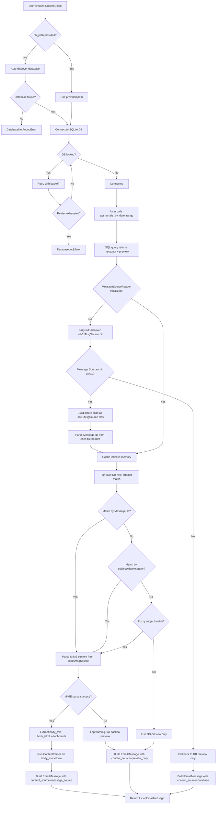
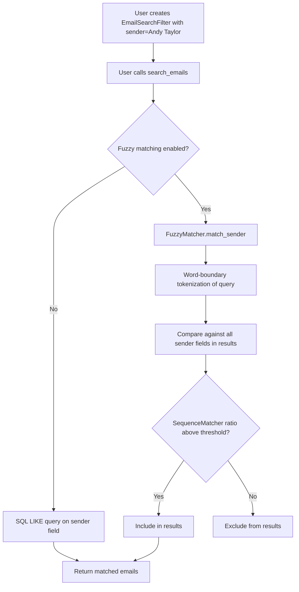
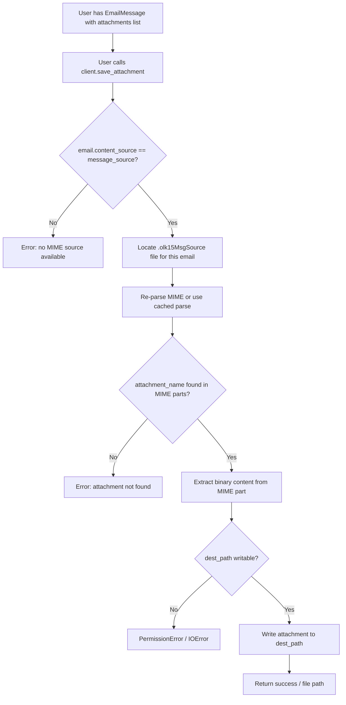
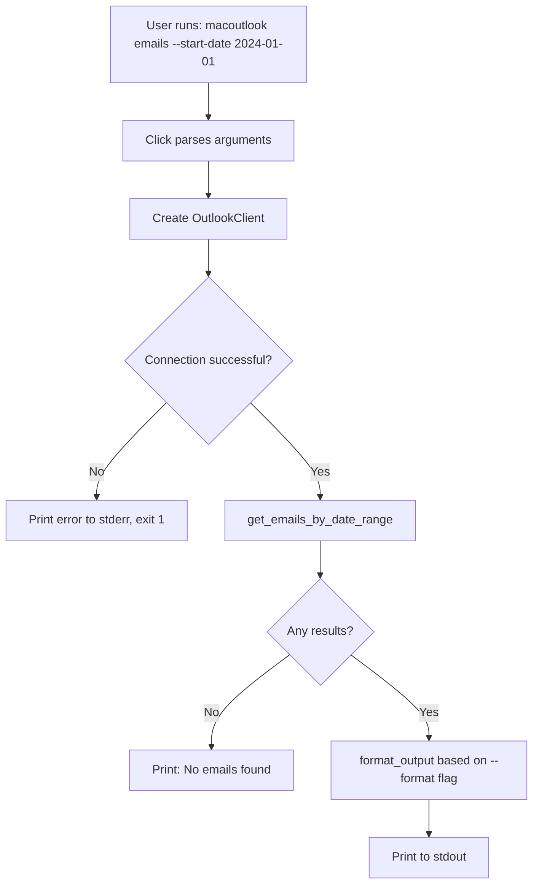
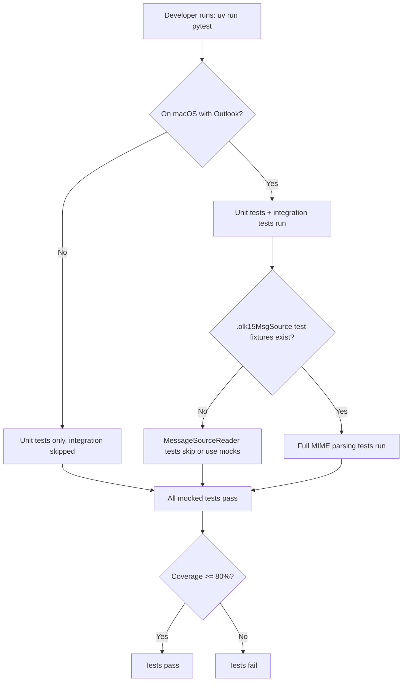
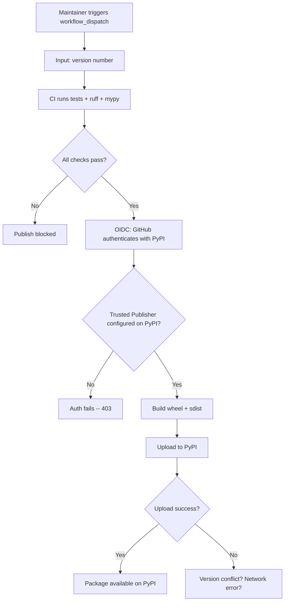
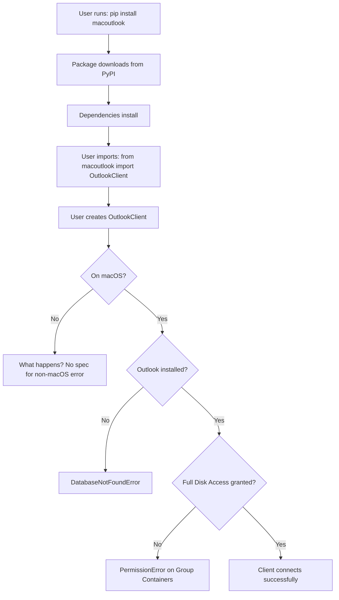
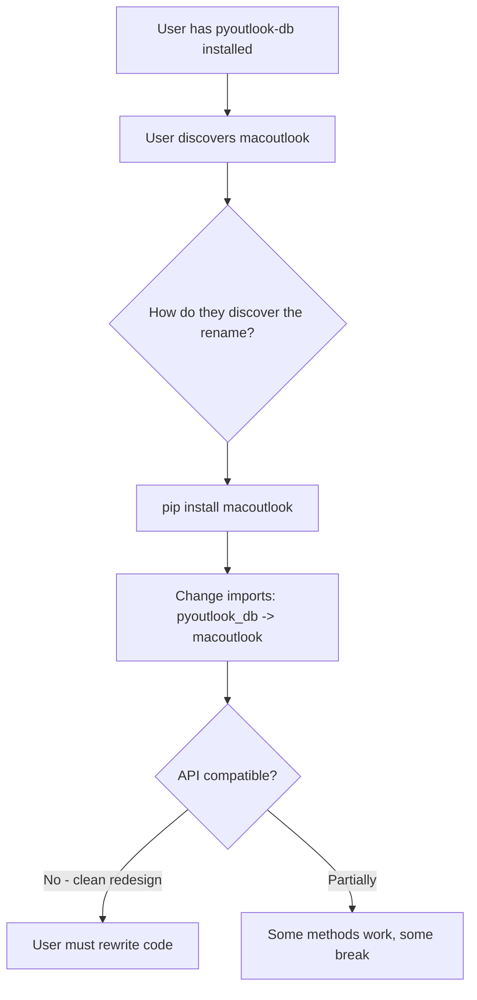

# User Flow Analysis: macoutlook Full Content Extraction

Date: 2026-03-14
Spec Analyzed: `docs/brainstorms/2026-03-14-full-content-extraction-brainstorm.md`
Codebase Reference: `docs/research/2026-03-14-refactor-research.md`

---

## User Flow Overview

Eight distinct user flows emerge from this specification. Each is mapped below with decision points, branches, and failure modes.

### Flow 1: Library User -- Get Emails with Full Content

**Sub-flows within this flow:**
- Index building (one-time per session)
- Per-email matching cascade (3 strategies)
- Per-email MIME parsing
- Per-email content conversion pipeline
- Graceful degradation at every failure point

### Flow 2: Library User -- Search Emails by Sender with Fuzzy Matching

**Key question**: Is fuzzy matching applied post-query (fetch all, filter in Python) or does it modify the SQL query? The brainstorm says "integrated as a search option" but does not specify the strategy. Post-query filtering is simpler but scales poorly with large result sets.

### Flow 3: Library User -- Extract and Save Attachments

### Flow 4: CLI User -- Running Email Commands

**New CLI concerns for macoutlook:**
- How does CLI expose content_source in output?
- Does the CLI show attachment metadata? Can user save attachments via CLI?
- Is there a new `--no-full-content` flag to skip .olk15MsgSource enrichment?
- How does fuzzy search surface in CLI? New `--fuzzy` flag on search command?

### Flow 5: Developer -- Running Tests

### Flow 6: Maintainer -- Publishing to PyPI

### Flow 7: First-Time User -- Installing from PyPI

### Flow 8: Package Rename Migration -- Existing User

---

## Flow Permutations Matrix

### Email Retrieval Permutations

| Dimension | Variant A | Variant B | Variant C |
|---|---|---|---|
| **Content source** | .olk15MsgSource exists + matches | .olk15MsgSource exists, no match | No .olk15MsgSource dir |
| **content_source value** | "message_source" | "preview_only" | "database" |
| **body_text** | Full text from MIME | None | Preview text (~256 chars) |
| **body_html** | Full HTML from MIME | None | None (DB has no HTML) |
| **body_markdown** | Generated from HTML | None | Generated from preview |
| **attachments** | list[AttachmentInfo] from MIME | [] | [] |
| **Match strategy** | Message-ID / subject+date / fuzzy | All 3 failed | N/A |

### Platform/Environment Permutations

| Scenario | Database | .olk15MsgSource | Expected Behavior |
|---|---|---|---|
| macOS + Outlook installed + closed | Available | Available | Full functionality |
| macOS + Outlook installed + open | Possibly locked | Available (files not locked by Outlook?) | DB retry, file read should work |
| macOS + Outlook not installed | Not found | Not found | DatabaseNotFoundError |
| macOS + modern Outlook (new Outlook) | Different schema? | Different file format? | Unknown -- not specified |
| Linux/Windows | Not found | Not found | What error? How early? |
| macOS + no Full Disk Access | PermissionError | PermissionError | Need clear error message |

### Matching Strategy Permutations

| Scenario | Message-ID in DB? | Message-ID in file? | Subject match? | Result |
|---|---|---|---|---|
| Perfect match | Yes | Yes, matches | N/A | content_source=message_source |
| No Message-ID in DB | No | Yes | Yes, exact | Falls to strategy 2: subject+date+sender |
| Malformed Message-ID | Yes but garbled | Yes | Yes | Strategy 1 fails, strategy 2 succeeds |
| Duplicate subjects | N/A | N/A | Multiple matches | Which file wins? Ambiguity. |
| Forwarded email | Different Message-ID | Different | Similar subject with "Fwd:" | Fuzzy may false-positive |
| Reply chain | Different Message-ID | Different | "Re: Re: Re: Original" | Subject match may fail |

### Attachment Save Permutations

| Scenario | Expected Behavior |
|---|---|
| Email has content_source=message_source, attachment exists | Save succeeds |
| Email has content_source=preview_only | Cannot save -- no MIME data |
| Email has content_source=database | Cannot save -- no MIME data |
| Attachment name contains path separators | Security risk -- path traversal |
| Attachment name contains unicode | Encoding handling needed |
| dest_path is a directory vs. full file path | Which is expected? |
| dest_path already exists | Overwrite? Error? |
| Attachment is inline (CID reference) | Is it in the attachments list? |
| Attachment is very large (100MB+) | Memory implications of MIME parsing |

---

## Missing Elements and Gaps

### Category: MessageSourceReader Specification

**Gap 1: .olk15MsgSource directory discovery**
- **What's missing**: The brainstorm specifies the path `~/Library/Group Containers/UBF8T346G9.Office/Outlook/Outlook 15 Profiles/Main Profile/Data/Message Sources/` but does not address: What if the user has multiple profiles? What if they use "Outlook 16 Profiles" or higher? The current `OutlookDatabase` searches profiles 15-18 -- does MessageSourceReader need the same multi-profile search?
- **Impact**: Users with non-default profiles would get `content_source=database` for all emails despite having .olk15MsgSource files.
- **Current Ambiguity**: Is the Message Sources directory always a sibling of the Outlook.sqlite file?

**Gap 2: Index building strategy**
- **What's missing**: The brainstorm says "build index on first use, cache for session" but does not define: What constitutes "first use"? Is it when `get_emails_by_date_range` is called? What if the user only calls `get_calendars`? Is there a `prewarm_index()` method? What data is stored in the index -- just Message-ID to file path, or also subject+date+sender for fallback matching?
- **Impact**: If the index only stores Message-ID, the fallback strategies require re-reading files on every match attempt, destroying performance.
- **Current Ambiguity**: The index needs to store enough metadata for all 3 matching strategies, not just Message-ID.

**Gap 3: Index invalidation**
- **What's missing**: What happens if new emails arrive during a session? The cached index becomes stale. Is there a way to refresh? What about long-running processes (e.g., MCP server) that hold a client open for hours?
- **Impact**: New emails received during a session would get content_source=preview_only even though .olk15MsgSource files exist.

**Gap 4: File read permissions and locking**
- **What's missing**: The brainstorm mentions Outlook database locking but does not address whether .olk15MsgSource files can be locked by Outlook. Are they opened exclusively when Outlook is running? The database layer has retry logic for locks -- does the file reader need similar logic?
- **Impact**: If files are locked while Outlook is open, the entire enrichment pipeline fails silently.

**Gap 5: Concurrent .olk15MsgSource file access**
- **What's missing**: If Outlook is writing a new .olk15MsgSource file while we're reading it (e.g., email arriving during index build), what happens? Partial read? Corrupt MIME?
- **Impact**: Corrupt MIME parse could crash the entire email retrieval, not just one email.

### Category: Matching Strategy

**Gap 6: Message-ID availability in the SQLite database**
- **What's missing**: This is explicitly listed as an open question in the brainstorm: "Does the Outlook SQLite DB store Message-ID headers?" This is a critical unknown that determines whether strategy 1 (the primary strategy) works at all.
- **Impact**: If the DB does not store Message-ID, the entire matching architecture changes. Strategy 2 (subject+date+sender) becomes primary, which is inherently less reliable.
- **Current Ambiguity**: The SQL column names in client.py do not include a Message-ID column. The current queries use `Record_RecordID` which is an internal DB identifier, not an RFC 2822 Message-ID.

**Gap 7: Duplicate handling in matching**
- **What's missing**: What happens when multiple .olk15MsgSource files match the same DB record (e.g., same subject, same date, same sender -- common with mailing lists or automated notifications)? What happens when the same .olk15MsgSource file matches multiple DB records?
- **Impact**: False positives mean the wrong email body is attached to the wrong metadata. This is a data integrity issue.

**Gap 8: Fuzzy match threshold**
- **What's missing**: What SequenceMatcher ratio threshold constitutes a "match" for strategy 3? 0.8? 0.9? Is it configurable? What about false positives from similar but different subjects (e.g., "Q1 Budget Review" vs "Q2 Budget Review")?
- **Impact**: Too low a threshold causes wrong content attachment; too high misses legitimate matches.

**Gap 9: Match confidence/quality indicator**
- **What's missing**: The EmailMessage model has `content_source` which distinguishes "message_source" from "preview_only", but there is no indication of which matching strategy was used or the confidence level. Was this a Message-ID exact match or a 0.82 fuzzy match?
- **Impact**: Consumers cannot make quality judgments about the data. An LLM consuming this data should know if the body might be from a different email.

### Category: EmailMessage Model Redesign

**Gap 10: Migration from current model**
- **What's missing**: The brainstorm says "clean redesign -- backward compatibility with the current API is not required" but does not define the exact field mapping. The current model has `content_html`, `content_text`, `content_markdown`. The new model has `body_html`, `body_text`, `body_markdown`, `preview`. What happens to `folder`, `is_read`, `is_flagged`, `priority`, `bcc_recipients`, `message_size`, `conversation_id`? Are these kept, removed, or renamed?
- **Impact**: Implementation ambiguity about which fields survive the redesign.

**Gap 11: content_source enum vs string**
- **What's missing**: The brainstorm shows `content_source: str` with values "message_source" | "database" | "preview_only". Should this be a proper enum (like EmailPriority) for type safety, or a string literal?
- **Impact**: Minor, but affects IDE autocomplete, validation, and serialization consistency.

**Gap 12: body_text vs preview relationship**
- **What's missing**: When content_source is "message_source", what goes in `preview`? Is it still the DB's ~256 char preview, or is it generated from body_text? When content_source is "preview_only", is body_text None or does it contain the preview text?
- **Impact**: Consumers need clear contracts about which fields are populated under which conditions.

**Gap 13: Distinction between "database" and "preview_only"**
- **What's missing**: The brainstorm defines three content_source values but does not clearly distinguish "database" from "preview_only". Looking at the current code, the DB only stores `Message_Preview` (~256 chars). There is no full content in the DB. So when would content_source be "database" (implying full content from DB) vs "preview_only"?
- **Impact**: If there is no meaningful distinction, one of these values is redundant and confusing.

### Category: AttachmentInfo Model and save_attachment

**Gap 14: AttachmentInfo field completeness**
- **What's missing**: The brainstorm specifies `filename, size, content_type` but does not mention: content_id (for inline attachments), is_inline (boolean), encoding, disposition (attachment vs inline), index/position within the MIME tree. These are important for distinguishing inline images from real attachments.
- **Impact**: Users cannot distinguish a company logo embedded in the email signature from a PDF the sender attached.

**Gap 15: save_attachment API design**
- **What's missing**: The method signature is described as `save_attachment(email, attachment_name, dest_path)` but: Does `email` mean the EmailMessage object or a message_id string? Is `attachment_name` the exact filename or can it be a partial match? What does `dest_path` accept -- a directory (auto-naming) or a full file path? What is the return type?
- **Impact**: API design ambiguity leads to inconsistent implementation.

**Gap 16: Attachment content access without saving**
- **What's missing**: Is there a way to get attachment content as bytes in memory without writing to disk? This is important for piping to other tools or for the `docextract` integration mentioned in the brainstorm.
- **Impact**: Users wanting to process attachments programmatically would need to save to a temp file and read it back -- wasteful.

**Gap 17: save_attachment for preview_only emails**
- **What's missing**: What happens when a user tries to save an attachment from an email where content_source is "preview_only" or "database"? The email may have `has_attachments=True` (from DB) but no MIME data to extract from. What error is raised?
- **Impact**: Users see `has_attachments=True` in the model, try to save, and get an unclear error.

### Category: FuzzyMatcher

**Gap 18: FuzzyMatcher scope and API**
- **What's missing**: The brainstorm says "word-boundary-aware fuzzy matching for sender/recipient search" but does not define: Is FuzzyMatcher a standalone class or integrated into EmailSearchFilter? Is it used only for sender search or also for subject search? How does it interact with the existing `search_emails` method? Is there a new parameter on EmailSearchFilter like `fuzzy: bool = False`?
- **Impact**: Without clear API design, the feature could be implemented inconsistently between library and CLI.

**Gap 19: FuzzyMatcher and SQL interaction**
- **What's missing**: Does fuzzy matching happen in SQL (impossible with SequenceMatcher) or in Python post-filter? If post-filter, what is the initial SQL query? Does it fetch ALL emails and filter, or does it use a broad LIKE query first to narrow candidates?
- **Impact**: Post-filtering all emails for a fuzzy sender search on a 50K+ mailbox would be extremely slow. A two-stage approach (SQL LIKE for candidates, then Python fuzzy filter) is necessary but not specified.

**Gap 20: FuzzyMatcher for DB-to-file matching vs search**
- **What's missing**: The brainstorm mentions fuzzy matching in two contexts: (1) as the third fallback strategy for matching DB records to .olk15MsgSource files, and (2) as a search feature for users. Are these the same FuzzyMatcher class used in different contexts, or separate implementations?
- **Impact**: Code reuse opportunity if they share logic, but different tuning requirements (matching needs high precision, search needs high recall).

### Category: Performance

**Gap 21: Index building time for large mailboxes**
- **What's missing**: The brainstorm acknowledges this as an open question but does not specify: What is the maximum acceptable index build time? Is there a progress callback? Should there be a persistent cache (e.g., pickle/JSON file) that survives across sessions?
- **Impact**: A 50K+ file scan with MIME header parsing could take 30+ seconds. First-time users would experience an unexplained hang.

**Gap 22: Memory usage for index**
- **What's missing**: If the index stores Message-ID + subject + date + sender for 50K+ files, what is the memory footprint? Is there a limit on index size?
- **Impact**: For very large mailboxes (enterprise users with 100K+ emails), memory could become an issue.

**Gap 23: MIME parsing per-email overhead**
- **What's missing**: After matching, each email requires full MIME parsing to extract body and attachments. For a `get_emails_by_date_range` call returning 1000 emails, that is 1000 file reads + 1000 MIME parses. Is there any caching? Is MIME parsing lazy (only when body fields are accessed)?
- **Impact**: Retrieving 1000 emails with full content could take tens of seconds. The current DB-only approach is milliseconds.

**Gap 24: Opt-out of full content enrichment**
- **What's missing**: Is there a parameter to skip .olk15MsgSource enrichment entirely? The current API has `include_content: bool` but that controls whether the DB preview is parsed. Does setting `include_content=False` also skip MIME enrichment? Is there a separate parameter like `enrich_content: bool`?
- **Impact**: Users who only need metadata (subject, sender, date) would pay the full MIME parsing cost unnecessarily.

### Category: Error Handling

**Gap 25: New exception types needed**
- **What's missing**: The current exception hierarchy has `DatabaseNotFoundError`, `DatabaseLockError`, `ConnectionError`, `ParseError`, `ValidationError`. New scenarios need coverage: MessageSourceNotFoundError (no .olk15MsgSource dir), MIMEParseError (corrupt MIME file), MatchingError (ambiguous match), AttachmentNotFoundError, AttachmentSaveError. Are these new exceptions or mapped to existing ones?
- **Impact**: Without specific exceptions, error handling in consuming code is imprecise.

**Gap 26: Per-email error isolation**
- **What's missing**: The current code has a try/except per row that logs and continues (line 191 of client.py). Does the new enrichment pipeline maintain this isolation? If MIME parsing fails for email #47 out of 100, does the entire call fail or does email #47 get content_source=preview_only while the other 99 get full content?
- **Impact**: One corrupt .olk15MsgSource file should not break retrieval of all other emails.

**Gap 27: Error reporting granularity**
- **What's missing**: When returning a list of emails, some with full content and some with preview-only, how does the caller know which ones failed enrichment and why? Is there an errors/warnings collection on the response?
- **Impact**: Silent degradation is good for resilience but bad for debugging. Users may not realize they are getting incomplete data.

### Category: Package Rename

**Gap 28: Repository rename strategy**
- **What's missing**: The brainstorm specifies the PyPI name change and import change, but does not address: Is the GitHub repository being renamed? If so, does the old URL redirect? What about the existing `pyoutlook-db` on PyPI (if it was ever published) -- is it marked as deprecated with a pointer to `macoutlook`?
- **Impact**: Existing users/links would break without proper redirects and deprecation notices.

**Gap 29: Version number for macoutlook**
- **What's missing**: Current version is 0.1.0. Does macoutlook start at 0.1.0 (fresh start) or 0.2.0/1.0.0 (reflecting the evolution)? Given the clean redesign with breaking changes, 1.0.0 or 0.1.0 both have arguments.
- **Impact**: Semantic versioning signal to users about stability and maturity.

### Category: CI/CD

**Gap 30: Test matrix for CI**
- **What's missing**: The brainstorm says "tests/ruff/mypy on PR" but does not specify: Which Python versions? Which OS runners (macOS only, or also Ubuntu for unit tests)? How are integration tests handled in CI (no Outlook DB available)?
- **Impact**: CI that only runs on macOS is slow and expensive. CI that runs on Ubuntu cannot run integration tests. Need a clear strategy.

**Gap 31: workflow_dispatch version input validation**
- **What's missing**: When the maintainer triggers a publish with a version input, is the version validated against the version in `__init__.py`? Or does the workflow update `__init__.py`? What prevents publishing the same version twice?
- **Impact**: Version mismatches between code and PyPI package cause confusion.

**Gap 32: PyPI Trusted Publisher first-time setup**
- **What's missing**: The brainstorm acknowledges this needs setup but does not detail the process. The maintainer needs to: create a PyPI account, create the `macoutlook` project on PyPI, configure the GitHub repo as a trusted publisher, set the correct workflow filename and environment name. This is a chicken-and-egg problem for the first publish.
- **Impact**: First publish will fail without prior manual PyPI configuration.

### Category: Security

**Gap 33: Path traversal in attachment filenames**
- **What's missing**: MIME attachment filenames are untrusted input. A filename like `../../../etc/passwd` or `../../../.ssh/authorized_keys` could be used for path traversal if `save_attachment` naively joins dest_path + filename.
- **Impact**: Security vulnerability. Attachment filenames MUST be sanitized.

**Gap 34: Malicious MIME content**
- **What's missing**: .olk15MsgSource files contain raw email MIME. Emails can contain: zip bombs (deeply nested MIME), extremely large base64 attachments, malformed headers designed to exploit parsers, emails with thousands of MIME parts. Is there any resource limiting?
- **Impact**: Processing a malicious email could cause memory exhaustion or extremely long parse times.

**Gap 35: Symlink attacks on .olk15MsgSource directory**
- **What's missing**: If an attacker can place a symlink in the Message Sources directory pointing to a sensitive file, the MIME parser would attempt to parse it and potentially expose contents in error messages.
- **Impact**: Low probability (requires local access) but should be considered.

### Category: Accessibility and Documentation

**Gap 36: Non-macOS platform behavior**
- **What's missing**: The library is macOS-only. What happens when a user installs it on Linux or Windows? Is there an early, clear error at import time? At client creation time? Only when database discovery fails?
- **Impact**: Poor developer experience. A user on Linux installing `macoutlook` gets a confusing `DatabaseNotFoundError` rather than a clear "this library only works on macOS" message.

**Gap 37: New Outlook for Mac (Microsoft 365)**
- **What's missing**: Microsoft has been migrating Mac users to "New Outlook for Mac" which uses a different data storage architecture (cloud-first, potentially different local cache). Does "New Outlook" still use .olk15MsgSource files? Does it still have a local SQLite database?
- **Impact**: The library could become obsolete for a growing portion of the user base without anyone realizing until it fails.

---

## Critical Questions Requiring Clarification

### CRITICAL (Blocks Implementation or Creates Data/Security Risks)

**Q1: Does the Outlook SQLite database contain a Message-ID column?**
- Why it matters: This determines whether the primary matching strategy (Message-ID exact match) is viable. If not, the entire matching architecture shifts to subject+date+sender as primary, which is fundamentally less reliable.
- Assumption if unanswered: Message-ID is NOT in the DB (the current SQL queries show no such column). Plan for subject+date+sender as the primary strategy and extract Message-ID only from .olk15MsgSource files to build the index. This means the index must also store subject+date+sender metadata.
- Example: If the DB has a column like `Record_MessageID` or `Message_InternetMessageId`, strategy 1 works directly. If not, we need to extract Message-ID from .olk15MsgSource files AND extract subject+date+sender, then match against DB metadata.

**Q2: What exactly happens with duplicate matches in the subject+date+sender strategy?**
- Why it matters: Automated emails, mailing list digests, and notification emails frequently have identical subjects, identical senders, and timestamps within the same second. Attaching the wrong body to the wrong email is a data integrity failure.
- Assumption if unanswered: When multiple .olk15MsgSource files match the same DB record with equal confidence, skip enrichment for that email (content_source=preview_only) and log a warning. Better to have no body than the wrong body.
- Example: Two emails from "noreply@github.com" with subject "[repo] PR Review" at 14:32:01 and 14:32:01. Both match strategy 2. Which .olk15MsgSource file maps to which DB row?

**Q3: How should attachment filenames be sanitized to prevent path traversal?**
- Why it matters: This is a security vulnerability. The `save_attachment(email, attachment_name, dest_path)` method will write files to disk using filenames from untrusted MIME data.
- Assumption if unanswered: Strip all path separators and parent directory references from filenames. Use `pathlib.Path(filename).name` to extract just the filename component. Reject empty filenames.
- Example: `filename="../../.ssh/authorized_keys"` should be sanitized to `"authorized_keys"` and written only within dest_path.

**Q4: What resource limits exist for MIME parsing?**
- Why it matters: A single malformed or malicious email could cause the entire process to hang or run out of memory.
- Assumption if unanswered: Set a maximum file size for .olk15MsgSource parsing (e.g., 50MB). Set a maximum number of MIME parts (e.g., 1000). Set a timeout for individual file parsing. Skip files that exceed limits and log a warning.

**Q5: Is the Message Sources directory path always a sibling of the Outlook.sqlite file?**
- Why it matters: The database discovery already handles multiple profile paths (15-18). If the Message Sources directory relationship to the DB is predictable, the MessageSourceReader can derive its path from the database path. If not, it needs its own discovery logic.
- Assumption if unanswered: The Message Sources directory is at `{profile_dir}/Data/Message Sources/` where `{profile_dir}` is the parent of the directory containing Outlook.sqlite. Derive it from the discovered database path.

### IMPORTANT (Significantly Affects UX or Maintainability)

**Q6: What is the index data structure and what metadata is stored per file?**
- Why it matters: Determines whether fallback matching strategies require re-reading files or can use cached metadata.
- Assumption if unanswered: The index stores per file: `{file_path, message_id, subject, sender, date, file_size}`. This supports all three matching strategies from the cached index without re-reading files.

**Q7: Is there an API to skip content enrichment for performance?**
- Why it matters: Retrieving 1000 emails with full MIME parsing could be orders of magnitude slower than metadata-only retrieval. Users who only need subjects and senders should not pay this cost.
- Assumption if unanswered: Add an `enrich: bool = True` parameter to `get_emails_by_date_range` and `search_emails`. When False, skip .olk15MsgSource matching entirely and return content_source="database" for all emails. The existing `include_content` parameter controls whether even the preview is parsed.

**Q8: How does FuzzyMatcher interact with the existing search API?**
- Why it matters: The brainstorm says "integrated as a search option" but does not specify the API surface. Does EmailSearchFilter gain a `fuzzy: bool` field? Is it a separate method?
- Assumption if unanswered: Add `fuzzy: bool = False` to EmailSearchFilter. When True, sender/subject matching uses FuzzyMatcher post-filter with a broad SQL LIKE pre-filter. The threshold defaults to 0.8 and is configurable on the FuzzyMatcher class.

**Q9: What is the relationship between body_text, body_html, body_markdown, and preview across content_source values?**
- Why it matters: Consumers need a clear contract about which fields are populated when. A matrix should define this explicitly.
- Assumption if unanswered:

| Field | content_source=message_source | content_source=preview_only | content_source=database |
|---|---|---|---|
| preview | DB preview (~256 chars) | DB preview (~256 chars) | DB preview (~256 chars) |
| body_text | Full text from MIME | None | None |
| body_html | Full HTML from MIME | None | None |
| body_markdown | Generated from body_html | None | None |

**Q10: Can users access attachment bytes in memory without saving to disk?**
- Why it matters: Critical for programmatic processing, piping to other tools, and integration with docextract.
- Assumption if unanswered: Add `get_attachment_content(email, attachment_name) -> bytes` method alongside `save_attachment`. Or return bytes from `save_attachment` even when writing to disk.

**Q11: How does the CLI expose the new features?**
- Why it matters: The CLI is a first-class consumer. New features (fuzzy search, attachment listing, content source visibility) need CLI surfaces.
- Assumption if unanswered: (a) `macoutlook emails` output includes `content_source` field. (b) `macoutlook search --fuzzy` enables fuzzy matching. (c) `macoutlook attachments --email-id X` lists attachments. (d) `macoutlook save-attachment --email-id X --name Y --dest Z` saves to disk.

**Q12: What happens on non-macOS platforms?**
- Why it matters: Users on Linux/Windows will install the package and get confusing errors.
- Assumption if unanswered: Add a platform check at `OutlookClient.__init__` that raises a clear `PlatformError("macoutlook only supports macOS. Current platform: {sys.platform}")` on non-Darwin systems.

### NICE-TO-HAVE (Improves Clarity but Has Reasonable Defaults)

**Q13: Should the index be persistent across sessions?**
- Why it matters: A persistent index (e.g., pickle file alongside the DB) would eliminate the first-use scan cost on subsequent runs.
- Assumption if unanswered: Start with in-memory-only caching. Add persistent caching as a future enhancement if benchmarks show the first-use cost is problematic.

**Q14: What version number does macoutlook launch with?**
- Why it matters: Semantic versioning signal.
- Assumption if unanswered: 0.1.0 (fresh start for a new package name, reflecting alpha status).

**Q15: Does the "database" content_source value add value over "preview_only"?**
- Why it matters: Looking at the current code, the database only stores `Message_Preview` (~256 chars). There does not appear to be a scenario where full content comes from the DB but not from .olk15MsgSource. Having two values that mean the same thing is confusing.
- Assumption if unanswered: Collapse to two values: "message_source" (full content from MIME) and "preview_only" (DB preview only). Remove "database" unless there is a concrete scenario where it differs from "preview_only".

**Q16: What is the CI test runner OS?**
- Why it matters: macOS runners are more expensive and slower. Unit tests with mocks can run on Ubuntu.
- Assumption if unanswered: Run unit tests on Ubuntu (fast, cheap). Run integration tests on macOS (requires Outlook paths). The matrix would be: `{os: [ubuntu-latest, macos-latest], test-type: [unit, integration]}` with integration tests only on macOS.

**Q17: Is "New Outlook for Mac" (cloud-based) in scope?**
- Why it matters: Microsoft is actively migrating users to the new Outlook which may not have local SQLite databases or .olk15MsgSource files.
- Assumption if unanswered: Out of scope for v0.1.0. Document the limitation. Add a clear error message if the expected data directories are not found.

---

## Recommended Next Steps

1. **Investigate the DB schema** (blocks Q1): Run `PRAGMA table_info(Mail)` against a real Outlook database to determine if Message-ID is stored. This single finding changes the matching architecture.

2. **Verify .olk15MsgSource path relationship** (blocks Q5): Confirm that the Message Sources directory is always at a predictable path relative to the database file.

3. **Define the field population matrix** (blocks Q9, Q10, Q12, Q15): Create an explicit table showing which EmailMessage fields are populated under each content_source scenario. This becomes the contract for implementation.

4. **Design the save_attachment security model** (blocks Q3, Q4): Define filename sanitization rules, resource limits, and the exact method signatures before implementation.

5. **Benchmark index building** (informs Q13, Q21): Scan a real Message Sources directory and measure: number of files, time to scan, time to parse headers, memory usage of the index.

6. **Write the plan document**: With answers to Q1-Q5, proceed to `/workflows:plan` for detailed implementation design including module boundaries, method signatures, and test strategy.
