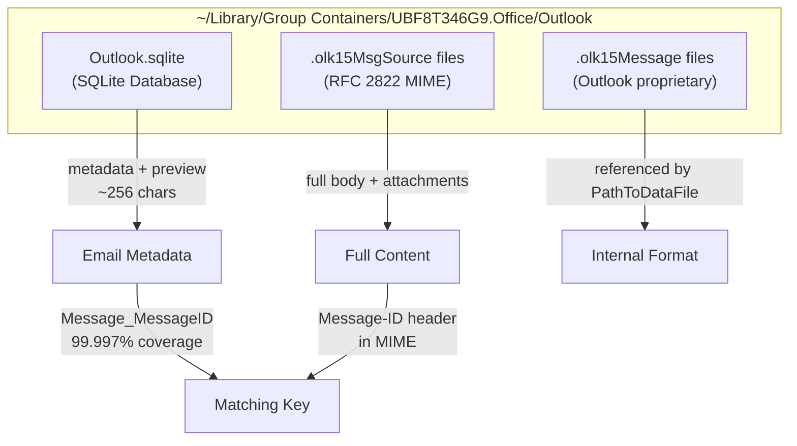
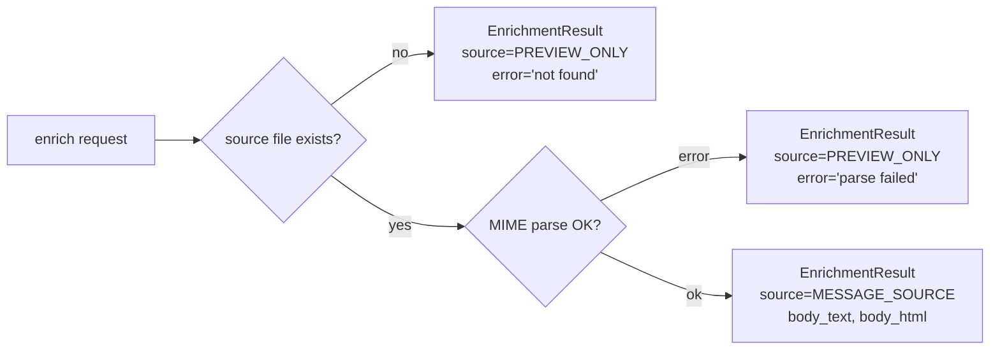

# Lessons Learned: macoutlook

Key technical discoveries and design patterns from building macoutlook.

## macOS Outlook Data Architecture



### Database Schema
- `Mail` table has **46 columns** — most Outlook features map to a column
- `Message_MessageID` stores the RFC 2822 Message-ID (not `Record_RecordID`)
- `Message_Preview` is always ~256 chars truncated — this is the 0.1% extraction problem
- `PathToDataFile` references `.olk15Message` files (proprietary format), NOT `.olk15MsgSource`
- Timestamps are Unix epoch (not Core Foundation epoch like CalendarEvents)

### .olk15MsgSource File Format
- **Binary preamble**: 32-36 bytes before RFC 2822 content starts
  - Bytes 0-3: magic `d00d0000`
  - Bytes 16-31: UUID matching filename
  - Bytes 32-35: `crSM` marker
- **Line endings**: CR-only (`\r`), not CRLF — must normalize before email parser
- **Location**: `Message Sources/NN/UUID.olk15MsgSource` (256 numbered subdirectories)
- **53,909 files** vs 32,560 DB records — ~21K orphans from deleted/moved emails
- UUIDs do NOT match between `Messages/` and `Message Sources/` directories

## Performance: macOS Group Containers Access

**Critical discovery**: macOS adds ~12ms latency per file open in Group Containers.

| Operation | Time | Notes |
|-----------|------|-------|
| `os.scandir` walk (53K files) | 1.5s | Fast, no file reads |
| Read 2KB per file | 12ms/file | macOS access control overhead |
| Cold index build (53K files) | ~10 min | Acceptable as one-time operation |
| Warm cache load | 0.1s | JSON deserialization only |
| Single MIME parse | 150ms | Full BytesParser processing |

**Lesson**: Never build the index eagerly. Persistent caching is essential — cold build is a one-time CLI command (`macoutlook build-index`), warm loads are instant.

**Lesson**: `BytesHeaderParser` is also slow (~200ms/file) because it still opens and processes the file. Regex on first 2KB is the fastest approach for Message-ID extraction.

## Design Patterns Applied

### Never-Raises Enrichment


**Why**: Enrichment is best-effort. One malformed email shouldn't crash a batch of 1000. The caller checks `result.source` to know if enrichment succeeded, without try/except.

### Dependency Injection via Constructor
```python
# Testing: inject mocks directly
client = OutlookClient(database=mock_db, enricher=mock_enricher)

# Production: factory wires defaults
client = create_client(enable_enrichment=True)
```

**Why**: Eliminated global singletons (`get_database()`, `get_content_parser()`) that were not thread-safe and required `unittest.mock.patch` acrobatics in tests.

### Frozen Pydantic Models + model_copy for Enrichment
```python
# EmailMessage is frozen=True — can't mutate
enriched = email.model_copy(update={
    "body_text": result.body_text,
    "content_source": ContentSource.MESSAGE_SOURCE,
})
```

**Why**: Frozen models prevent accidental mutation of shared data. `model_copy` creates a new instance for enrichment without touching the original.

### Typed Enums over Magic Strings/Ints
```python
# Before (fragile):
content_source: str = "preview_only"
flag_status: int = 0
priority: int = 3

# After (type-safe):
content_source: ContentSource = ContentSource.PREVIEW_ONLY
flag_status: FlagStatus = FlagStatus.NOT_FLAGGED
priority: Priority = Priority.NORMAL
```

**Why**: Mypy catches invalid values at type-check time. No more guessing what `priority=3` means.

## Security Patterns

### SQL Injection Prevention
- **Table name allowlisting**: `_KNOWN_TABLES` frozenset, validated before PRAGMA/COUNT queries
- **Parameterized queries**: All user-provided values use `?` placeholders
- **Removed `where_clause` parameter**: The old `get_row_count(table, where_clause)` accepted raw SQL

### Attachment Filename Sanitization
- `Path(filename).name` strips directory components (`../../etc/passwd` -> `passwd`)
- `dest.resolve().is_relative_to(target_dir.resolve())` prevents path traversal
- Applied at MIME parse time (before storing in model) AND at save time (defense in depth)

### Module Name Shadowing
- Renamed `models/email.py` -> `models/email_message.py` to avoid shadowing `import email` (stdlib)
- Renamed `ConnectionError` -> `DatabaseConnectionError` to avoid shadowing builtin

## Pydantic v2 Migration Gotchas

| v1 Pattern | v2 Replacement | Gotcha |
|-----------|---------------|--------|
| `@validator` | `@field_validator` | Must add `@classmethod` |
| `@validator(values=...)` | `@model_validator(mode='after')` | `values` dict → `self` access |
| `Config` class | `model_config = ConfigDict(...)` | `json_encoders` removed entirely |
| `json_encoders={datetime:...}` | `@field_serializer` | Per-field, not global |
| `.dict()` | `.model_dump()` | Also `.json()` → `.model_dump_json()` |
| `Optional[X]` | `X \| None` | Python 3.10+ syntax |

## stdlib Logging for Libraries

**Lesson**: Libraries should use `logging.getLogger(__name__)`, NOT structlog.

```python
# Wrong (for a library):
import structlog
logger = structlog.get_logger(__name__)

# Right:
import logging
logger = logging.getLogger(__name__)
```

**Why**: `structlog` is an application-level concern. The application configures logging output format. If a library uses structlog, it forces the application to also use structlog. stdlib `logging` is always available and plays well with any logging framework the application chooses.
