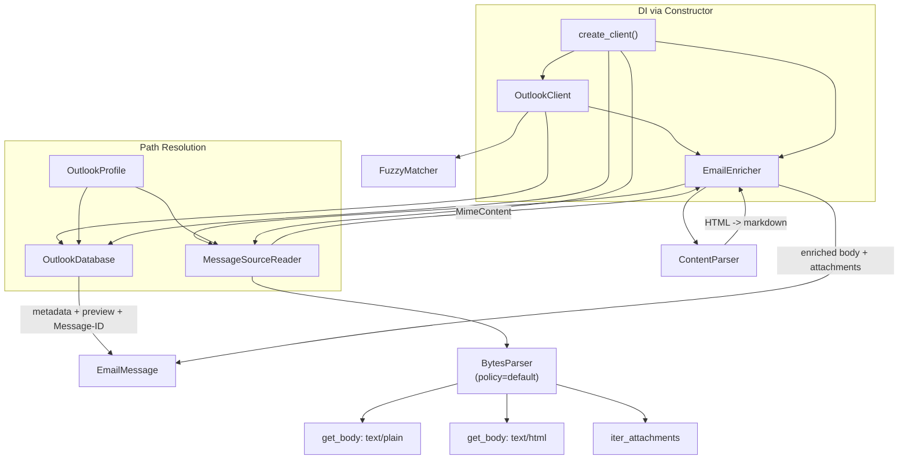
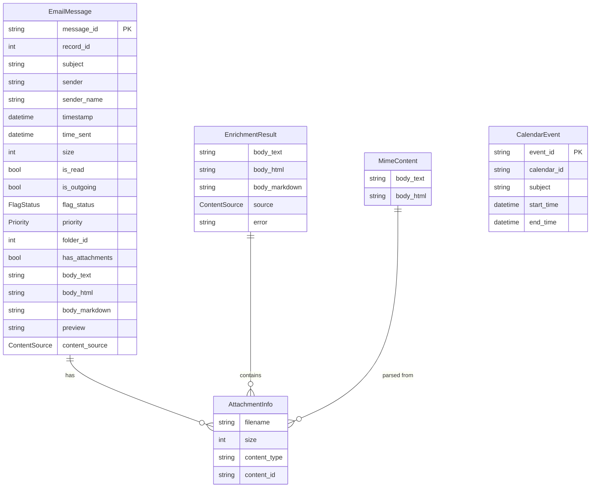

# Rename to macoutlook and Integrate Full Email Content Extraction

## Enhancement Summary

**Deepened on:** 2026-03-14
**Agents used:** 8 (Python reviewer, Performance oracle, Security sentinel, Architecture
strategist, Code simplicity, Pattern recognition, Best practices researcher, Framework docs)
**Review files:** `docs/reviews/2026-03-14-{security,architecture,simplification}-review.md`,
`docs/analysis/2026-03-14-{performance,design-pattern}-review.md`

### Critical Design Changes from Reviews

1. **Lazy enrichment** (Performance): Don't MIME-parse all emails upfront. Store source file
   path on the model, parse on demand. Turns 70s batch into <2s.
2. **Index persistence** (Performance): Persist Message-ID -> path index to disk with
   mtime-based delta updates. CLI invocations are separate sessions.
3. **BytesParser, not message_from_string** (Framework docs): `.olk15MsgSource` files are raw
   bytes. Use `BytesParser(policy=policy.default).parse(fp)` in `'rb'` mode.
4. **HeaderParser for index building** (Python reviewer): Only parse headers during index
   build, not full MIME. 53K files at 8KB reads vs full file reads.
5. **Extract EmailEnricher class** (Architecture + Pattern): Prevent OutlookClient God Class.
   Encapsulates enrichment pipeline like docextract's `ParserRouter`.
6. **Message-ID only matching** (Simplicity): 99.997% coverage (32,559/32,560). Drop the
   3-tier cascade. YAGNI for v1.
7. **DI via constructor** (Architecture): `OutlookClient.__init__` accepts dependencies.
   `create_client()` factory for convenience.
8. **Security prerequisites** (Security): Fix existing SQL injection, add `nh3` for HTML
   sanitization, `Path.resolve()` + `is_relative_to()` for attachment paths.
9. **Rename models/email.py -> models/email_message.py** (Security): Current name shadows
   stdlib `email` module we'll be importing heavily.

---

## Overview

Transform pyoutlook-db into `macoutlook` -- a production-quality Python library for extracting
full email content from macOS Outlook. The current library only reads `Message_Preview` (~256
chars) from the SQLite database. By integrating `.olk15MsgSource` file reading (RFC 2822 MIME
format), we achieve 858x content extraction improvement (0.1% -> 85.8%+ extraction ratio).

This is a clean redesign. No backward compatibility with the current API is required.

**Attribution**: The `.olk15MsgSource` extraction approach was discovered by Jon Hammant in the
`outlook-connector-package` project.

## Problem Statement

The current `pyoutlook-db` library is fundamentally limited:
- Only reads `Message_Preview` from SQLite (~256 chars, 0.1% of email content)
- Missing RFC 2822 Message-ID (uses internal `Record_RecordID` instead)
- Missing attachment metadata (only boolean `has_attachments`)
- Missing useful fields: FlagStatus, Priority, TimeSent, Size, ReadFlag
- Pydantic v1 API debt (`@validator`, `.dict()`, `json_encoders`) despite requiring pydantic>=2.0
- Global singletons for database/parser (not thread-safe, hard to test)
- SQL injection in `database.py` (f-string interpolation of table names and where clauses)
- `models/email.py` shadows Python's stdlib `email` module
- `ConnectionError` class shadows Python's builtin `ConnectionError`
- ~200 lines of dead code (`EmailStats`, `_row_to_email`, `extract_links`, `extract_images`)
- Duplicated row-to-model conversion (3 different patterns in `client.py`)
- Package name "pyoutlook-db" is misleading (library reads files too, not just DB)
- No CI/CD, no PyPI publishing, only 2 unit tests
- `structlog` used in a library (should be stdlib `logging`)

## Proposed Solution

Rename to `macoutlook`, redesign the core to read both SQLite metadata AND `.olk15MsgSource`
MIME files, with a clean Pydantic v2 model, proper test suite, and GitHub Actions CI/CD
publishing to PyPI.

## Technical Approach

### Architecture

```
macoutlook/
├── core/
│   ├── client.py            # OutlookClient (orchestrator, thin)
│   ├── database.py          # OutlookDatabase (SQLite access)
│   ├── enricher.py          # EmailEnricher (NEW: enrichment pipeline)
│   ├── message_source.py    # MessageSourceReader (NEW: .olk15MsgSource)
│   └── profile.py           # OutlookProfile (NEW: shared path resolution)
├── models/
│   ├── email_message.py     # EmailMessage, AttachmentInfo (redesigned)
│   ├── calendar.py          # CalendarEvent (updated to Pydantic v2)
│   └── enums.py             # ContentSource, FlagStatus, Priority (NEW)
├── parsers/
│   ├── content.py           # ContentParser (HTML -> text/markdown)
│   └── icalendar.py         # ICalendarParser
├── search.py                # FuzzyMatcher (NEW, flat module)
├── cli/
│   └── main.py              # Click CLI (renamed command)
├── exceptions.py            # Custom exceptions (renamed classes)
└── __init__.py              # Public API exports
```



### Research Insights: Architecture

**From Architecture Strategist + Pattern Recognition:**
- **EmailEnricher** prevents OutlookClient from becoming a God Class (already 590 lines).
  Mirrors docextract's `ParserRouter` pattern. Owns: index lookup, MIME parsing, content
  extraction, ContentParser delegation. Exposes single `enrich(email) -> EmailMessage` method.
- **OutlookProfile** extracts duplicated path resolution (both `OutlookDatabase.find_database_path()`
  and `MessageSourceReader` need the Outlook profile directory). Also makes testing with
  synthetic data directories trivial.
- **DI via constructor**: `OutlookClient.__init__` accepts `database`, `enricher`, `parser`
  instances. `create_client(db_path=None)` factory for the common case. Essential for MCP
  server integration (keep DB open, build index once, reuse across requests).
- **Never-raises contract** for enrichment: `EmailEnricher.enrich()` returns `EnrichmentResult`
  (frozen dataclass with `body_text`, `body_html`, `attachments`, `source`, `error`). Failures
  produce a result with `source="preview_only"` and `error` set, never raise exceptions.

### DB Schema Findings (Verified)

The `Mail` table has **46 columns**. Key findings:

| Column | Type | Current Usage | Plan |
|--------|------|---------------|------|
| `Record_RecordID` | INTEGER | Used as message_id | Internal ID only |
| `Message_MessageID` | TEXT | **Not used** | Primary matching key (100% coverage: 32,559/32,560) |
| `Message_Preview` | TEXT | Used as content_html | Demoted to `preview` field |
| `Message_NormalizedSubject` | TEXT | Used | Keep |
| `Message_SenderAddressList` | TEXT | Used | Keep |
| `Message_SenderList` | TEXT | Used | Keep |
| `Message_ToRecipientAddressList` | TEXT | Used | Keep |
| `Message_CCRecipientAddressList` | TEXT | Used | Keep |
| `Message_TimeReceived` | DATETIME | Used | Keep |
| `Message_TimeSent` | DATETIME | **Not used** | Add to model |
| `Message_HasAttachment` | BOOLEAN | Used | Keep (quick filter) |
| `Message_Size` | INTEGER | **Not used** | Add to model |
| `Message_ReadFlag` | BOOLEAN | **Not used** | Add to model |
| `Record_FlagStatus` | INTEGER | **Not used** | Add to model |
| `Record_Priority` | INTEGER | **Not used** | Add to model |
| `Record_FolderID` | INTEGER | **Not used** | Add to model (folder filtering) |
| `Message_IsOutgoingMessage` | BOOLEAN | **Not used** | Add to model |

**Source files**: 53,909 `.olk15MsgSource` files vs 32,560 DB records (~21K extra from
deleted/moved emails -- index must handle orphans gracefully).

### Implementation Phases

#### Phase 1: Package Rename, Security Fixes, and Foundation

Rename `pyoutlook_db` -> `macoutlook`, fix security issues, fix Pydantic v2 debt, delete dead
code, establish DI pattern. **Tests accompany each change** (not deferred to a separate phase).

**Tasks:**

- [ ] Rename `src/pyoutlook_db/` -> `src/macoutlook/`
- [ ] Rename `models/email.py` -> `models/email_message.py` (avoid shadowing stdlib `email`)
- [ ] Update `pyproject.toml`: name, version (0.2.0), entry point, URLs, build paths
  - `pyproject.toml:1` -- `[project] name = "macoutlook"`
  - Entry point: `macoutlook = "macoutlook.cli.main:cli"`
  - `[tool.hatch.build.targets.wheel] packages = ["src/macoutlook"]`
  - `[tool.ruff.lint.isort] known-first-party = ["macoutlook"]`
  - Update author to personal name
- [ ] Update all internal imports: `pyoutlook_db` -> `macoutlook`
- [ ] Update all test imports: `pyoutlook_db` -> `macoutlook`
- [ ] Update CLAUDE.md references
- [ ] **Security: Fix SQL injection in `database.py`**
  - Remove `where_clause` parameter from `get_row_count()`
  - Allowlist table names against known schema (not f-string interpolation)
  - Use parameterized queries everywhere
- [ ] **Security: Rename `ConnectionError` -> `DatabaseConnectionError`** (shadows builtin)
- [ ] **Delete dead code** (~200 lines):
  - `EmailStats`, `CalendarStats`, `CalendarEventFilter` classes
  - `_row_to_email()` (unused helper with wrong column names)
  - `extract_links()`, `extract_images()` from ContentParser
  - Unused filter parameters on model classes
  - `_parse_attachments()` (dead code)
- [ ] **Replace `structlog` with stdlib `logging`** throughout:
  - `import logging; logger = logging.getLogger(__name__)`
  - Remove `structlog` from dependencies
- [ ] **Use `pathlib` exclusively** -- remove all `os.path` and `import glob` usage
- [ ] Migrate Pydantic models to v2 API:
  - `@validator` -> `@field_validator` (with `@classmethod`)
  - `@validator` with `values` param -> `@model_validator(mode='after')` for cross-field validation
  - `Config` class -> `model_config = ConfigDict(frozen=True)`
  - `.dict()` -> `.model_dump()`, `.json()` -> `.model_dump_json()`
  - `json_encoders = {datetime: ...}` -> `@field_serializer` for datetime
  - Delete `to_dict()`, `to_json()`, `get_summary()` wrappers (Pydantic v2 provides these)
  - `Optional[X]` -> `X | None`
- [ ] **Move recipient string parsing from models to client layer**
  - Models receive clean `list[str]`, client does the semicolon splitting
- [ ] **Consolidate row-to-model conversion** into a single `_row_to_email()` private method
- [ ] **Tighten exception handling**: catch `ValueError | KeyError`, not bare `Exception`
- [ ] Create `models/enums.py`:

```python
from enum import IntEnum, StrEnum

class ContentSource(StrEnum):
    MESSAGE_SOURCE = "message_source"
    PREVIEW_ONLY = "preview_only"

class FlagStatus(IntEnum):
    NOT_FLAGGED = 0
    FLAGGED = 1
    COMPLETE = 2

class Priority(IntEnum):
    LOW = 1
    NORMAL = 3
    HIGH = 5
```

- [ ] Create `core/profile.py`:

```python
class OutlookProfile:
    """Shared path resolution for Outlook data directories."""

    def __init__(self, profile_path: Path | None = None) -> None:
        self.profile_path = profile_path or self._discover_profile()

    @property
    def database_path(self) -> Path: ...
    @property
    def message_sources_dir(self) -> Path: ...

    @staticmethod
    def _discover_profile() -> Path: ...
```

- [ ] Establish DI pattern -- `OutlookClient.__init__` accepts dependencies:

```python
class OutlookClient:
    def __init__(
        self,
        database: OutlookDatabase | None = None,
        enricher: EmailEnricher | None = None,
        profile: OutlookProfile | None = None,
    ) -> None: ...

def create_client(db_path: Path | None = None) -> OutlookClient:
    """Factory for the common case."""
    profile = OutlookProfile(db_path.parent if db_path else None)
    database = OutlookDatabase(profile.database_path)
    enricher = EmailEnricher(MessageSourceReader(profile.message_sources_dir))
    return OutlookClient(database=database, enricher=enricher, profile=profile)
```

- [ ] Verify: `uv build` produces correct wheel, `uv run macoutlook info` works
- [ ] Write tests for: enums, profile path resolution, security fixes, model validation

**Success criteria**: Package builds and installs as `macoutlook`. Security issues fixed.
Dead code removed. Pydantic v2 API. DI pattern established. Tests pass.

#### Phase 2: MessageSourceReader and Lazy Content Enrichment

Core feature -- read `.olk15MsgSource` files and enrich emails with full content on demand.

**Tasks:**

- [ ] Create `src/macoutlook/core/message_source.py`:
  - `MessageSourceReader` class
  - **Index building with `HeaderParser`** (headers only, not full message):
    ```python
    from email.parser import BytesHeaderParser
    from email import policy

    parser = BytesHeaderParser(policy=policy.default)
    with open(path, 'rb') as f:
        headers = parser.parse(f)  # Only reads headers, stops before body
    message_id = headers['message-id']
    ```
  - **Read only first 8KB per file** during index build (`os.read(fd, 8192)` if
    HeaderParser proves too slow on 53K files)
  - Use `os.scandir()` instead of `glob.glob()` for file discovery (faster, no sorting)
  - Index structure: `dict[str, str]` mapping Message-ID -> file path string
    (not `dict[str, Path]` -- saves ~8MB at 54K entries)
  - **Message-ID only matching** for v1 (99.997% coverage). No fallback cascade.
  - `get_source_path(message_id: str) -> str | None` -- returns path or None
  - `get_content(message_id: str) -> MimeContent | None` -- full MIME parse on demand

- [ ] **Index persistence** to avoid rebuilding every CLI invocation:
  - Persist index to `~/.cache/macoutlook/message_index.json`
  - Store `{message_id: path, ...}` plus `{"_meta": {"mtime": ..., "count": ...}}`
  - On load: check `Message Sources/` directory mtime. If unchanged, use cached index.
  - Delta update: if mtime changed, scan for new files only (compare count)
  - Cold build: <10 seconds for 53K files. Warm load: <1 second.

- [ ] **MIME parsing with `BytesParser` + `policy.default`**:
  ```python
  from email.parser import BytesParser
  from email import policy

  with open(source_path, 'rb') as f:
      msg = BytesParser(policy=policy.default).parse(f)

  # High-level API (handles multipart automatically):
  text_body = msg.get_body(preferencelist=('plain',))
  html_body = msg.get_body(preferencelist=('html',))

  body_text = text_body.get_content() if text_body else None  # Returns str
  body_html = html_body.get_content() if html_body else None  # Returns str
  ```
  - Handles `multipart/alternative`, `multipart/mixed`, encoding automatically
  - `get_content()` auto-decodes quoted-printable, base64, and charset
  - Graceful handling: parser records defects on `.defects` list, rarely raises

- [ ] Create `MimeContent` frozen dataclass (intermediate type from MessageSourceReader):

```python
@dataclass(frozen=True, slots=True)
class MimeContent:
    body_text: str | None
    body_html: str | None
    attachments: tuple[AttachmentInfo, ...]
    defects: tuple[str, ...]  # Any MIME parsing defects
```

- [ ] Create `core/enricher.py`:

```python
@dataclass(frozen=True, slots=True)
class EnrichmentResult:
    body_text: str | None = None
    body_html: str | None = None
    body_markdown: str | None = None
    attachments: tuple[AttachmentInfo, ...] = ()
    source: ContentSource = ContentSource.PREVIEW_ONLY
    error: str | None = None

class EmailEnricher:
    """Enrichment pipeline. Never raises -- returns EnrichmentResult."""

    def __init__(
        self,
        source_reader: MessageSourceReader,
        content_parser: ContentParser | None = None,
    ) -> None: ...

    def enrich(self, message_id: str) -> EnrichmentResult:
        """Look up source file, parse MIME, convert HTML -> markdown."""
        ...
```

- [ ] **Lazy enrichment on EmailMessage**:
  - `get_emails()` returns emails with `content_source=PREVIEW_ONLY` by default
  - Emails carry a `_source_path: str | None` (private, not serialized)
  - `client.enrich_email(email) -> EmailMessage` parses on demand (returns new frozen instance)
  - `client.get_emails(enrich=True)` enriches all (for batch operations)
  - `client.get_emails(enrich=False)` returns metadata-only (fast path, <2s for 1000 emails)
  - **Markdown conversion opt-in**: `enrich_email(email, markdown=True)` (markdownify is slow)

- [ ] Attachment metadata from MIME parts:
  - Use `msg.iter_attachments()` (skips body parts automatically)
  - `part.get_filename()` for filename (checks Content-Disposition then Content-Type)
  - `part.get_content_type()` for MIME type
  - `len(part.get_content())` for size
  - **Security**: Sanitize filenames at parse time (strip path components, reject traversal)
  - `AttachmentInfo.size: int | None = None` (not always determinable)

- [ ] Redesigned `EmailMessage` model:

```python
class AttachmentInfo(BaseModel):
    model_config = ConfigDict(frozen=True)

    filename: str
    size: int | None = None
    content_type: str
    content_id: str | None = None

class EmailMessage(BaseModel):
    model_config = ConfigDict(frozen=True)

    # Identity
    message_id: str              # RFC 2822 Message-ID
    record_id: int               # Internal DB ID

    # Metadata
    subject: str
    sender: str
    sender_name: str | None = None
    recipients: list[str]
    cc_recipients: list[str]
    timestamp: datetime           # TimeReceived
    time_sent: datetime | None = None
    size: int | None = None
    is_read: bool = False
    is_outgoing: bool = False
    flag_status: FlagStatus = FlagStatus.NOT_FLAGGED
    priority: Priority = Priority.NORMAL
    folder_id: int | None = None
    has_attachments: bool = False

    # Content (richest available -- populated lazily via enrich_email())
    body_text: str | None = None
    body_html: str | None = None
    body_markdown: str | None = None
    preview: str | None = None

    # Attachments
    attachments: tuple[AttachmentInfo, ...] = ()

    # Provenance
    content_source: ContentSource = ContentSource.PREVIEW_ONLY
```

- [ ] `save_attachment()` method on `OutlookClient`:
  - Takes email message_id, attachment filename, destination path
  - Re-parses source file, extracts matching MIME part, writes bytes
  - **Path validation**: `dest.resolve().is_relative_to(target_dir.resolve())`
  - **Filename sanitization**: `Path(filename).name` to strip directory components
  - Consider LRU cache on parsed MIME messages for batch save operations

- [ ] **Resource exhaustion limits**:
  - Skip source files >100MB during index build
  - Limit attachment count per email to 200 (defensive)
  - Timeout on MIME parsing (malformed emails can cause slow parsing)

- [ ] **HTML sanitization**: Add `nh3` dependency for allowlist-based HTML sanitization
  of `body_html` (emails can contain XSS payloads, event handlers, javascript: URIs)

- [ ] Handle edge cases:
  - **No source file found**: Return email with `content_source=PREVIEW_ONLY`
  - **MIME parse failure**: Log warning, set `EnrichmentResult.error`, return preview
  - **Orphan source files** (no DB record): Ignored (index is keyed by Message-ID)
  - **One email with no Message-ID** (1 of 32,560): Falls through, gets preview only

- [ ] Write tests for: MessageSourceReader (index build, persistence, lookup),
  EmailEnricher (enrich flow, error handling, never-raises), MIME parsing fixtures,
  attachment security (path traversal, filename injection)

**Success criteria**: `client.get_emails(enrich=True)` returns emails with full body content.
Extraction ratio >99% (given 99.997% Message-ID coverage). Lazy enrichment: `get_emails()`
without enrich returns in <2s for 1000 emails. Index persistence: warm CLI startup <1s.

### Research Insights: MIME Parsing

**From Framework Docs Researcher (Python email stdlib deep-dive):**

- **Always `BytesParser`, never `message_from_string()`**: `.olk15MsgSource` files are raw
  RFC 2822 MIME (a bytes format). Using `message_from_string()` risks charset corruption
  because you'd have to pick an encoding before the parser reads Content-Type headers.
- **`policy.default` is mandatory**: Every parser defaults to `compat32`, which returns
  legacy `Message` objects missing the modern API. `policy.default` gives `EmailMessage`
  with `get_body()`, `iter_parts()`, `iter_attachments()`, `get_content()`.
- **Parser almost never raises**: Records defects (subclasses of `MessageDefect`) on each
  part's `.defects` list. 12 defect types cover boundary issues, base64, headers.
  Critical gotcha: `InvalidBase64LengthDefect` keeps raw base64 undecoded.
- **`get_content()` auto-decodes**: For text parts returns `str` (handling both
  Content-Transfer-Encoding and charset). For binary parts returns `bytes`. Use
  `errors='replace'` because emails routinely lie about their charset.

### Research Insights: Performance

**From Performance Oracle:**

- **Lazy enrichment is the #1 performance win**: Eager enrichment of 1000 emails =
  ~70 seconds (70ms/email for MIME + markdownify). Lazy = <2 seconds (metadata only).
- **Index persistence is #2**: Every CLI invocation is a new session. Without persistence,
  every `macoutlook emails` command pays the full 10-second index build.
- **Use `fetchmany()` iterator** instead of `fetchall()` (current code materializes all rows).
- **Use `model_construct()`** for bulk trusted-source data from DB (skip Pydantic validation
  on known-good data). Only validate at system boundaries (user input, external APIs).
- **Fuzzy pre-filter**: SQL `LIKE` on name tokens first, then `SequenceMatcher` on ~500
  candidates (not all 32K senders).

#### Phase 3: Fuzzy Matching and Search

Integrate word-boundary-aware fuzzy matching into the search API.

**Tasks:**

- [ ] Create `src/macoutlook/search.py` (flat module, not package):
  - `FuzzyMatcher` class with configurable threshold (default 0.8)
  - Exact match -> word boundary match -> split-and-match with SequenceMatcher
  - Avoid partial matches ("Tom" must not match "Thomas")
  - `match(query: str, text: str) -> float` returns confidence score 0.0-1.0
- [ ] Add fuzzy search to `OutlookClient`:
  - `search_emails(query, fuzzy=False)` parameter
  - When `fuzzy=True`: pre-filter with SQL `LIKE '%token%'` on sender columns,
    then apply FuzzyMatcher to candidates (avoids O(32K) full scan)
  - Return `list[SearchResult]` where `SearchResult` has `email` + `confidence` fields
- [ ] Update CLI `search` command with `--fuzzy` flag
- [ ] Write tests for: exact match, boundary detection, partial rejection, threshold

**Success criteria**: `search_emails("Andy Taylor", fuzzy=True)` finds emails from
"Andrew Taylor" or "A. Taylor". Pre-filtered search completes in <500ms.

#### Phase 4: CLI Updates and Documentation

Update CLI for new features, write documentation, add attribution.

**Tasks:**

- [ ] Update CLI commands:
  - `macoutlook emails` -- show content_source, word count, extraction stats
  - `macoutlook emails --no-enrich` -- skip .olk15MsgSource reading (metadata only)
  - `macoutlook search --fuzzy` -- fuzzy sender matching
  - `macoutlook attachments <message-id>` -- list attachments for an email
  - `macoutlook attachments <message-id> --save <path>` -- save attachment to disk
  - `macoutlook info` -- show DB stats + source file count + enrichment coverage
- [ ] Create `CONTRIBUTORS.md`:
  ```
  # Contributors

  - **Jon Hammant** -- Discovered the .olk15MsgSource extraction approach that enables
    full email content recovery (858x improvement over database preview).
  ```
- [ ] Update `README.md`:
  - New package name and installation (`uv pip install macoutlook`)
  - Updated API examples with new model fields
  - Acknowledgements section crediting Jon Hammant
  - Performance comparison table (preview vs full content)
- [ ] Add module docstring to `core/message_source.py` crediting Jon Hammant
- [ ] Add `MessageSourceError` exception class for MIME parsing layer

**Success criteria**: CLI commands work with new features. README reflects new API. Attribution
in place.

#### Phase 5: GitHub Actions CI/CD and PyPI Publishing

Automate testing and enable manual PyPI publishing.

**Tasks:**

- [ ] Create `.github/workflows/ci.yml`:
  ```yaml
  name: CI
  on:
    push:
      branches: [main]
    pull_request:
      branches: [main]
  jobs:
    lint:
      runs-on: ubuntu-latest  # Lint doesn't need macOS
      steps:
        - uses: actions/checkout@v6
        - uses: astral-sh/setup-uv@v7
          with:
            enable-cache: true
        - run: uv sync --locked --dev
        - run: uv run ruff check .
        - run: uv run ruff format --check .
        - run: uv run mypy src/
    test:
      runs-on: macos-latest  # Tests may need macOS paths
      steps:
        - uses: actions/checkout@v6
        - uses: astral-sh/setup-uv@v7
          with:
            enable-cache: true
        - run: uv sync --locked --dev
        - run: uv run pytest tests/unit/ -v --tb=short
  ```
- [ ] Create `.github/workflows/publish.yml`:
  ```yaml
  name: Publish to PyPI
  on:
    workflow_dispatch:
      inputs:
        version:
          description: 'Version to publish (e.g., 0.2.0)'
          required: true
  jobs:
    publish:
      runs-on: ubuntu-latest
      environment: pypi
      permissions:
        id-token: write  # Required for OIDC -- must be at job level
      steps:
        - uses: actions/checkout@v6
        - uses: astral-sh/setup-uv@v7
          with:
            enable-cache: true
        - run: uv sync --locked --dev
        - run: uv run pytest tests/unit/ -v
        - run: uv build --no-sources  # Catches dependency issues
        - uses: pypa/gh-action-pypi-publish@release/v1
          # No API token needed -- uses Trusted Publishers OIDC
  ```
- [ ] **Configure PyPI Trusted Publisher (Pending Publisher)**:
  - Register as "pending publisher" on PyPI BEFORE first publish (no need to upload first)
  - Set: owner=`<github-user>`, repo=`macoutlook`, workflow=`publish.yml`, environment=`pypi`
- [ ] Create GitHub environment `pypi` with protection rules
- [ ] **Test on TestPyPI first** before real publish

### Research Insights: CI/CD

**From Best Practices Researcher:**

- **Split lint (ubuntu) from test (macos)**: Lint is platform-independent and ubuntu runners
  are 3-5x faster to start. Only tests need macOS.
- **`uv sync --locked`**: Catches lockfile drift in CI. Fails if `uv.lock` is stale.
- **`uv build --no-sources`**: Catches dependency issues before publish (ensures the wheel
  can be built without access to the source tree's editable install).
- **`permissions: id-token: write` at job level**: Must be on the job, not the workflow level,
  for OIDC to work with GitHub environments.
- **Pending publishers**: PyPI lets you configure OIDC before the package exists. No need to
  upload a placeholder version first.
- **`astral-sh/setup-uv@v7`** with `enable-cache: true` for fast installs.

**Success criteria**: PRs trigger CI (lint + test). Manual workflow_dispatch builds and
publishes to PyPI via OIDC.

## Alternative Approaches Considered

| Approach | Decision | Rationale |
|----------|----------|-----------|
| Port script as utility | Rejected | Doesn't fit layered library architecture |
| Hybrid enrichment layer | Rejected | Optional enrichment adds complexity without benefit |
| Regex MIME parsing | Rejected | Python stdlib `email` handles all edge cases |
| `message_from_string()` | Rejected | `.olk15MsgSource` is bytes; `BytesParser` avoids charset corruption |
| 3-tier matching cascade | Rejected | Message-ID has 99.997% coverage. YAGNI for v1 |
| Keep "pyoutlook-db" name | Rejected | Misleading -- library reads files too |
| API token for PyPI | Rejected | OIDC is more secure, no secrets to manage |
| Tag-triggered publish | Rejected | Manual dispatch gives more control |
| Eager enrichment | Rejected | 70s for 1000 emails vs <2s with lazy enrichment |
| Session-only index cache | Rejected | CLI invocations are separate sessions; need persistence |
| `structlog` for logging | Rejected | Libraries should use stdlib `logging` |
| `dict[str, Path]` for index | Rejected | `dict[str, str]` saves ~8MB at 54K entries |

## Acceptance Criteria

### Functional Requirements

- [ ] Package installs as `macoutlook` from PyPI
- [ ] `from macoutlook import OutlookClient, create_client` works
- [ ] `macoutlook` CLI command works (emails, calendars, search, attachments, info)
- [ ] Emails return full body content (body_text, body_html, body_markdown)
- [ ] Extraction ratio >99% (given 99.997% Message-ID coverage)
- [ ] Attachments listed with filename, size, content_type
- [ ] Attachments saveable to disk via API and CLI
- [ ] Fuzzy search finds "Andy Taylor" when DB has "Andrew Taylor"
- [ ] `content_source` field uses `ContentSource` StrEnum

### Non-Functional Requirements

- [ ] Cold index build for 53K source files completes in <10 seconds
- [ ] Warm index load (persisted) completes in <1 second
- [ ] `get_emails(enrich=False)` for 1000 emails completes in <2 seconds
- [ ] Single email enrichment (MIME parse) completes in <100ms
- [ ] No security vulnerabilities (SQL injection, path traversal, XXE, XSS)
- [ ] Type-checked with mypy (strict mode)
- [ ] Formatted and linted with ruff
- [ ] Uses stdlib `logging` (not structlog)

### Quality Gates

- [ ] Unit test coverage >80% on macoutlook/
- [ ] All ruff checks pass
- [ ] mypy passes with no errors
- [ ] CI green on PR
- [ ] Manual publish workflow tested on TestPyPI first
- [ ] Security tests pass (path traversal, filename injection, SQL injection)

## Dependencies and Prerequisites

| Dependency | Purpose | Status |
|------------|---------|--------|
| Python >=3.11 | f-strings, `X \| None` syntax | Already required |
| pydantic >=2.0 | Model validation | Already installed (API migration needed) |
| click | CLI framework | Already installed |
| beautifulsoup4 | HTML -> text conversion | Already installed |
| nh3 | Allowlist-based HTML sanitization | **NEW -- add to dependencies** |
| Python stdlib `email` | MIME parsing (BytesParser, HeaderParser) | No install needed |
| Python stdlib `difflib` | SequenceMatcher for fuzzy matching | No install needed |
| Python stdlib `logging` | Logging (replaces structlog) | No install needed |
| PyPI account | Package publishing | Needs setup |
| GitHub Actions | CI/CD | Needs `.github/workflows/` |

**Dependencies to remove:** `structlog`, `icalendar` (evaluate if still needed),
`python-dateutil` (evaluate -- may be replaceable with stdlib `datetime`)

## Risk Analysis and Mitigation

| Risk | Likelihood | Impact | Mitigation |
|------|-----------|--------|------------|
| .olk15MsgSource format varies by Outlook version | Medium | High | Test with samples; graceful fallback to preview; defects list |
| Index building too slow (53K files) | Low | Medium | HeaderParser (headers only), os.scandir, 8KB reads, persistence |
| MIME parsing fails on edge case emails | Medium | Low | Never-raises EnrichmentResult; log defects; preview fallback |
| macOS permissions block Group Containers access | Low | High | Document Full Disk Access requirement; clear error message |
| Outlook open locks source files | Low | Low | Files are read-only; SQLite uses `?mode=ro` URI |
| PyPI name squatted before publish | Very Low | High | Register as pending publisher immediately |
| Path traversal via attachment filenames | Medium | Critical | `Path.resolve()` + `is_relative_to()` + `Path(name).name` |
| XSS in body_html | Medium | Medium | `nh3` allowlist sanitization on all HTML content |
| SQL injection in existing code | Already present | Critical | Fix in Phase 1 as prerequisite |

## Data Model (ERD)



## References

### Internal

- Brainstorm: `docs/brainstorms/2026-03-14-full-content-extraction-brainstorm.md`
- SpecFlow analysis: `docs/analysis/2026-03-14-user-flow-analysis.md`
- Research: `docs/research/2026-03-14-refactor-research.md`
- Security review: `docs/reviews/2026-03-14-security-review.md`
- Architecture review: `docs/reviews/2026-03-14-architecture-review.md`
- Simplification analysis: `docs/reviews/2026-03-14-simplification-analysis.md`
- Performance review: `docs/analysis/2026-03-14-performance-review.md`
- Pattern analysis: `docs/analysis/2026-03-14-design-pattern-analysis.md`
- MIME parsing research: `docs/research/python-email-stdlib-research.py`
- Best practices: `docs/research/python-library-best-practices-2026.md`
- Source of enhancement: `/Users/taylaand/code/personal/tools/outlook-connector-package/getEmails_FULL_ENHANCED.py`
- docextract rename playbook: `/Users/taylaand/code/personal/tools/document_parsing/docs/plans/2026-03-14-refactor-docextract-pypi-package-plan.md`
- Security patterns: `/Users/taylaand/code/personal/tools/document_parsing/docs/mentoring/security-for-file-parsing.md`

### External

- Python `email` module: https://docs.python.org/3/library/email.html
- Python `email.policy`: https://docs.python.org/3/library/email.policy.html
- PyPI Trusted Publishers: https://docs.pypi.org/trusted-publishers/
- PyPI Pending Publishers: https://docs.pypi.org/trusted-publishers/creating-a-project-through-oidc/
- GitHub Actions OIDC: https://docs.github.com/en/actions/deployment/security-hardening-your-deployments/configuring-openid-connect-in-cloud-providers
- nh3 (HTML sanitizer): https://github.com/messense/nh3
