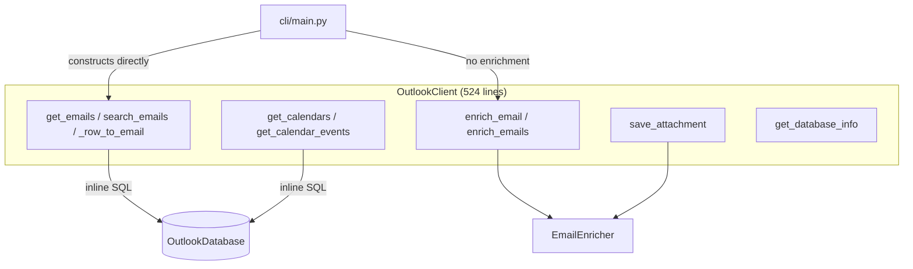
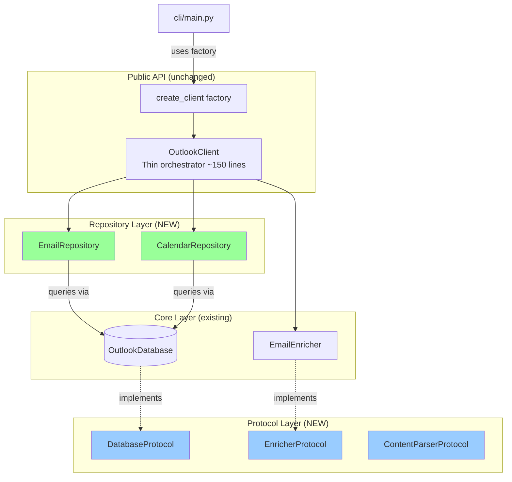
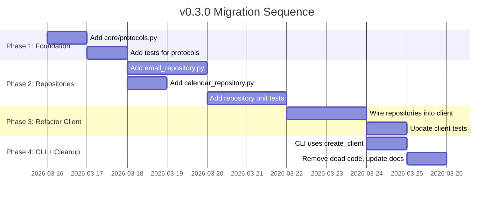

# macoutlook v0.3.0 Architecture Plan

| Field | Value |
|-------|-------|
| **Date** | 2026-03-15 |
| **Status** | Draft |
| **Scope** | Internal refactoring — no public API changes |

## 1. Problem Statement

`OutlookClient` at 524 lines is accumulating responsibilities across five domains: email retrieval, calendar retrieval, search, enrichment orchestration, and attachment management. It builds SQL queries inline, making the database layer a thin passthrough. DI injection points accept concrete classes, limiting testability. The CLI bypasses the `create_client()` factory.

### Current Architecture



### Problems

| # | Problem | Severity |
|---|---------|----------|
| P1 | OutlookClient has 5+ responsibilities (SRP violation) | High |
| P2 | SQL query construction in client layer | Medium |
| P3 | DI accepts only concrete types, no Protocol/ABC | Medium |
| P4 | CLI bypasses `create_client()` factory | Medium |
| P5 | `_row_to_email` row-mapping logic in orchestrator | Low |

## 2. Target Architecture



## 3. Detailed Changes

### 3.1 Protocol Definitions (`core/protocols.py`) — NEW

Protocols enable structural subtyping — existing classes satisfy them without inheritance changes.

```python
@runtime_checkable
class DatabaseProtocol(Protocol):
    is_connected: bool
    db_path: Path | None
    def connect(self) -> None: ...
    def disconnect(self) -> None: ...
    def execute_query(self, query: str, params: tuple | None = None) -> list[sqlite3.Row]: ...
    def get_table_names(self) -> list[str]: ...
    def get_row_count(self, table_name: str) -> int: ...

@runtime_checkable
class EnricherProtocol(Protocol):
    @property
    def index_size(self) -> int: ...
    def build_index(self, force: bool = False) -> int: ...
    def enrich(self, message_id: str, markdown: bool = True) -> EnrichmentResult: ...
    def save_attachment(self, message_id: str, attachment_filename: str, dest_dir: Path) -> Path: ...
```

**Risk**: Low. Additive change.
**Effort**: 2 hours.

### 3.2 Email Repository (`core/email_repository.py`) — NEW

Extracts: `get_emails()`, `search_emails()`, `_row_to_email()`, `_parse_delimited()`, `_EMAIL_QUERY_COLUMNS`, plus all inline SQL for the Mail table.

**Design decisions**:
- SQL stays in repository (not database.py) — repositories own domain-specific SQL
- Query builder methods return `(sql, params)` tuples for testability
- `_row_to_email` moves here — row-to-model mapping is domain logic
- Fuzzy matching stays as post-filter on parsed EmailMessage objects

**Risk**: Medium. Largest change. Tests need updating.
**Effort**: 6 hours.

### 3.3 Calendar Repository (`core/calendar_repository.py`) — NEW

Extracts: `get_calendars()`, `get_calendar_events()`, Core Foundation timestamp helpers, ICS-vs-DB branching.

**Risk**: Low-Medium.
**Effort**: 3 hours.

### 3.4 Refactored OutlookClient (`core/client.py`) — MODIFY

Becomes a thin orchestrator (~150 lines):
- Delegates email queries to `EmailRepository`
- Delegates calendar queries to `CalendarRepository`
- Keeps enrichment orchestration (cross-cutting concern)
- Keeps `get_database_info` (cross-cutting)

**Risk**: Medium. Public API preserved.
**Effort**: 4 hours.

### 3.5 CLI Factory Fix (`cli/main.py`) — MODIFY

Replace 5 direct `OutlookClient(db_path=...)` constructions with `create_client()`.

**Risk**: Low.
**Effort**: 1 hour.

## 4. Migration Path



### Step-by-step

| Step | Action | Risk | Parallel? |
|------|--------|------|-----------|
| 1 | Create `core/protocols.py` | Low | — |
| 2 | Create `core/email_repository.py` | Medium | Parallel with 3 |
| 3 | Create `core/calendar_repository.py` | Low-Med | Parallel with 2 |
| 4 | Refactor `OutlookClient` to delegate | Medium | After 2+3 |
| 5 | Update type hints to use Protocols | Low | After 4 |
| 6 | Fix CLI to use `create_client()` | Low | After 4 |
| 7 | Update exports and docs | Low | After 6 |

## 5. Risk Assessment

| Risk | Likelihood | Impact | Mitigation |
|------|-----------|--------|------------|
| Public API breakage | Low | High | Method signatures preserved exactly |
| Import cycle (protocols ↔ enricher) | Medium | Medium | `from __future__ import annotations` |
| Test fragility during migration | Medium | Medium | Dual-path testing during steps 2-4 |
| Over-engineering for current size | Low | Low | Pays for itself at next domain addition |

## 6. Effort Summary

| Component | Hours | Complexity |
|-----------|-------|------------|
| `core/protocols.py` + tests | 2h | Low |
| `core/email_repository.py` + tests | 6h | Medium |
| `core/calendar_repository.py` + tests | 3h | Low-Medium |
| Refactor `OutlookClient` + tests | 4h | Medium |
| CLI factory fix + tests | 1h | Low |
| Documentation updates | 1h | Low |
| **Total** | **~17h** | |

## 7. Validation Criteria

- [ ] All existing tests pass without modification (except reorganization)
- [ ] `OutlookClient` is under 200 lines
- [ ] No SQL strings exist in `client.py`
- [ ] `mypy` passes on all new files
- [ ] CLI commands produce identical output before and after
- [ ] `create_client()` is the sole construction path in CLI

## 8. Out of Scope for v0.3.0

- Do not move SQL into database.py (would create a different God Class)
- Do not make repositories public API (internal implementation detail)
- Do not add async support (v0.4+)
- Do not change `__all__` exports unless deliberately promoting repositories
